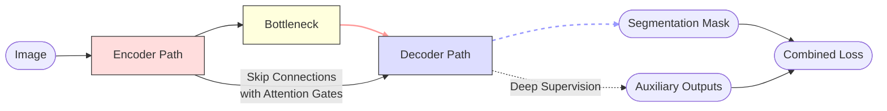
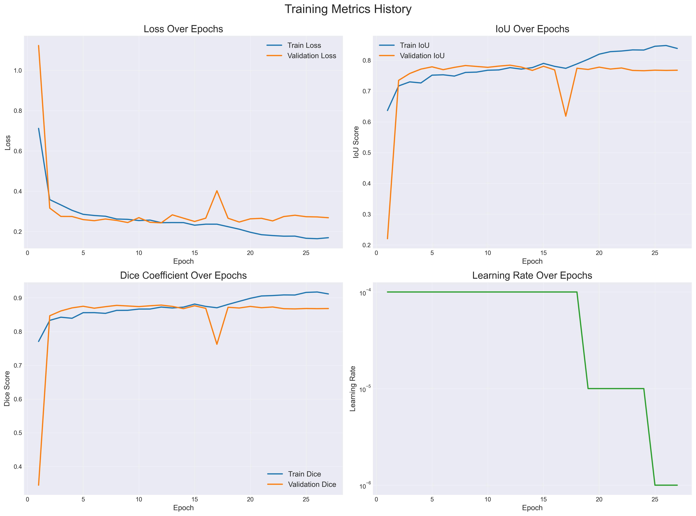
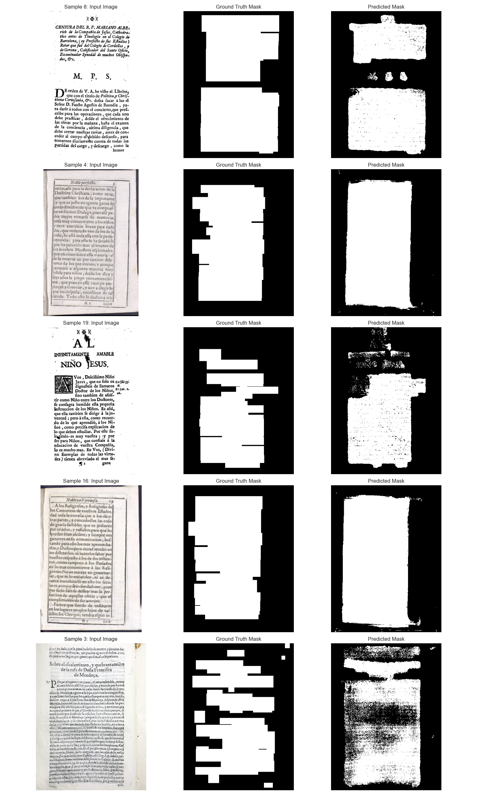

# Text Layout Detection Model

This repository contains my solution for specific task I for Renaissance project for HumanAI GSOC 2025 selection. 

## Project Overview

The project follows a complete machine learning workflow:
1. Data preprocessing and generation
2. Mask creation for segmentation
3. Model architecture design
4. Training pipeline implementation 
5. Evaluation and visualization

## Data Generation

### Preprocessing Pipeline

The preprocessing pipeline includes the following steps:

1. **PDF to Images**: Converting PDF documents to images using PyMuPDF (fitz)

2. **Image Transformation**: Each page image undergoes several transformations:
   - Skew correction
   - Image normalization
   - Resolution adjustment to ensure 300 PPI

3. **Standardization**: Images are resized and padded to a standard format (512×384 pixels)

### Mask Generation

For each document image, a mask is generated using OCR to identify text regions.

The process:
1. Uses Tesseract OCR to detect all text elements
2. Groups detected words into sentences based on line position
3. Creates bounding boxes around text regions
4. Draws filled rectangles on a binary mask for each text region

## Model Architecture


The model uses a U-Net architecture with attention mechanisms to identify text areas in document pages.

### Enhanced U-Net with Attention

The model is based on a U-Net architecture with several enhancements:

1. **Attention Gates**: Focus on relevant features during decoding

2. **Deep Supervision**: Multiple output paths at different scales

3. **Residual Connections**: Improving gradient flow

4. **Dropout Regularization**: Preventing overfitting

Key components:
- **DoubleConv**: Double convolution blocks with LeakyReLU activation
- **Down**: Downsampling paths with optional residual connections
- **Up**: Upsampling paths with attention gates
- **Bottleneck**: Feature channel expansion with dropout

## Model Training

### Custom Loss Function

A combined loss function to handle the challenges of text segmentation:

```python
class CombinedLoss(nn.Module):
    def __init__(self, dice_weight=0.5, bce_weight=0.3, focal_weight=0.2, ds_weight=0.3):
        # ... initialization ...
    
    def dice_loss(self, pred, target, smooth=1.0):
        # ... soft dice loss implementation ...
    
    def focal_loss(self, pred, target, alpha=0.25, gamma=2.0):
        # ... focal loss implementation ...
    
    def forward(self, outputs, target):
        # ... combines multiple losses with deep supervision handling ...
```

The loss combines:
1. **Dice Loss**: Better handling of class imbalance
2. **Binary Cross-Entropy**: Standard segmentation loss
3. **Focal Loss**: Emphasizes hard examples
4. **Deep Supervision Loss**: Additional gradient pathways

### Optimization

- **Adam optimizer** with weight decay for regularization
- **Learning rate scheduler** to reduce LR on plateaus
- **Early stopping** to prevent overfitting




## Evaluation Metrics

The model is evaluated using standard segmentation metrics:

### 1. IoU (Intersection over Union)
IoU measures the overlap between the predicted segmentation mask and the ground truth, calculated as the area of intersection divided by the area of union. In historical book layout detection, where precise separation of regions like body text, margins, and decorations is essential, IoU is particularly valuable. It penalizes both over-segmentation (predicting more than necessary) and under-segmentation (missing parts), making it a robust indicator of how well the model aligns with actual layout zones. A high IoU means the model is accurately capturing the spatial extent of layout components like text blocks.

### 2. Dice Coefficient (F1 Score)
The Dice coefficient, or F1 score, is the harmonic mean of precision and recall, emphasizing balance between false positives and false negatives. This is crucial for layout detection in degraded historical documents where annotations may be imprecise or ambiguous. For example, if a text block is faded or partially obstructed, the Dice score ensures that the model isn't unfairly penalized unless it's both missing true regions and hallucinating non-existent ones. It’s particularly helpful in imbalanced datasets, such as when text regions occupy much less space than the background or margins.

### 3. Precision
Precision quantifies how many of the model's positive predictions (e.g., "this is a text region") were actually correct. In the context of historical books, high precision means the model avoids falsely labeling decorative elements, page noise, or margins as text. This is especially important when preserving the authenticity of the document for downstream tasks like OCR, where false positives can lead to misrecognized characters or misaligned text extractions.

### 4. Recall
Recall reflects how many actual positive cases were correctly identified by the model. For historical layout detection, this translates to how much of the real text content was successfully segmented. High recall ensures that the model doesn’t miss faded or irregular text areas that are often found in Renaissance-era or damaged manuscripts. Missing these can lead to incomplete transcriptions or omitted sections in text digitization pipelines.

### 5. Accuracy
Accuracy in segmentation is the ratio of correctly classified pixels to the total number of pixels. While it gives a general sense of performance, it can be misleading in imbalanced datasets where background pixels dominate. For historical book layouts, where most pixels might belong to non-text areas, a high accuracy might still mean the model is poor at detecting text regions. Therefore, it’s useful as a supporting metric, but should be interpreted alongside IoU, Dice, precision, and recall for a complete picture.


| Metric         | Train        | Validation    | Test       |
|----------------|--------------|----------------|------------|
| Loss           | 0.2437       | 0.2428         | 0.2241     |
| IoU            | 0.7761       | 0.7841         | 0.7859     |
| Dice/F1        | 0.8726       | 0.8785         | 0.8791     |
| Accuracy       | —            | —              | 0.8806     |
| Precision      | —            | —              | 0.8879     |
| Recall         | —            | —              | 0.8716     |



## Requirements

- Python 3.7+
- PyTorch
- OpenCV
- PyMuPDF (fitz)
- pytesseract
- Tesseract OCR engine
- segmentation_models_pytorch
- pandas
- matplotlib
- scikit-learn
- tqdm

## Directory Structure

```
data/
├── 1_raw/            # Raw PDF files
├── 2_splitted/       # Images extracted from PDFs
├── 3_transformed/    # Preprocessed images
├── 4_final/          # Standardized images
└── masks/            # Generated segmentation masks

model_output/
└── model1/           # Trained model weights and logs
```
